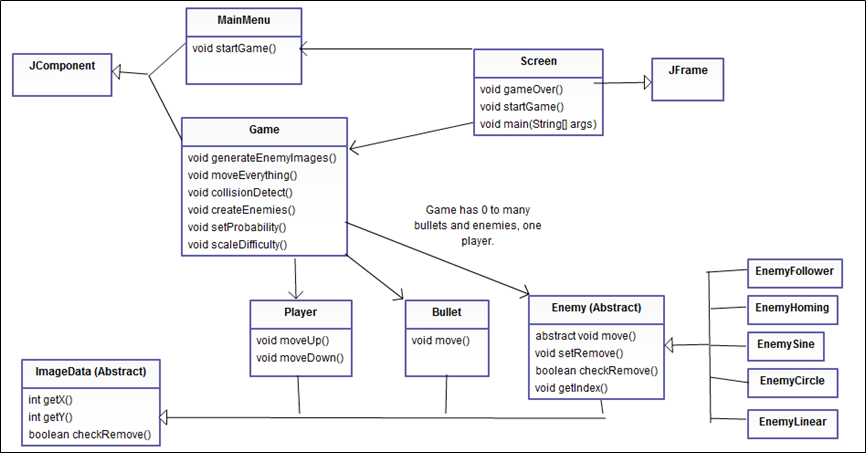

# About #

Fun undergrad project. Honestly, it's a terrible game but a good learning experience. And, for something that I wrote, neatly written!

The game presents Japanese characters at you. You are meant to shoot missiles containing incorrect characters, and collect missiles with correct ones. The difficulty changes slightly depending on how well you're doing.

Since the code structure isn't all that clear, I provided a UML diagram to shed light on it.

